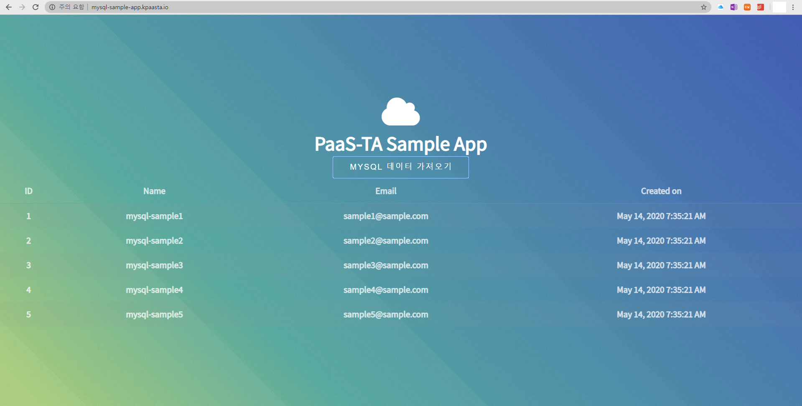

# 1-2. MySQL 서비스 사용하기

MySQL 서비스 신청을 완료한 뒤에는 App 을 생성하여 서비스에 bind 할 수 있습니다.

PaaS &gt; 앱 & 서비스 &gt; 앱 &gt; 앱 추가 메뉴를 차례대로 선택하면 다음과 같이 앱을 추가할 수 있는 페이지가 표시됩니다.

빌드팩을 선택하고 다음 버튼을 선택하면 다음과 같이 앱배포 설정을 할 수 있는 페이지가 표시됩니다. 여기서는 빌드팩으로 'java'를 선택합니다.

앱배포 설정 페이지에서 '\*' 항목은 필수 입력 항목입니다. 아래는 각 항목에 대한 설명입니다.

배포 옵션 - 서비스에서 기본 제공하는 App을 사용할 것인지, 사용자 App을 사용할 것인지 선택합니다.

앱명 - 다른 앱과 구분되도록 앱의 이름을 입력합니다.

도메인 - kpaasta.io 를 사용합니다.

파일 업로드 - 앱 war 파일을 업로드합니다.

시작옵션 - 앱을 배포만 할 것인지 배포하면서 바로 시작할 건지 선택합니다.

자원설정 - 인스턴스 갯수, 메모리 크기, 디스크 크기를 설정할 수 있습니다.

배포 버튼을 선택하면 '정상적으로 등록되었습니다' 팝업 화면이 표시됩니다.

팝업 화면을 닫으면 앱 상세 페이지가 표시됩니다. DB 접속 정보도 함 표시됩니다.

앞에서 App을 배포했으나 시작하지는 않았으므로 '인스턴스' 탭에 숫자가 0 으로 표시됩니다. 파랑색 삼각형 아이콘 \(play\) 을 선택하면 App을 기동시킬 수 있습니다. 정상적으로 기동하면 상태 컬럼에 녹색 'RUNNING' 으로 표시됩니다.

위의 페이지에서 '서비스 연결' 탭을 선택하면 아래와 같이 서비스 연결 탭 페이지가 표시됩니다.

위의 페이지에서 '관리도구' 컬럼의 '@DBWebTool'을 선택하면 MySQL DB에 접속할 수 있는 DB Client가 표시됩니다. 접속 정보에 있는 username, password 값을 이용하여 접속할 수 있습니다.

위의 페이지에서 '라우트' 탭을 선택하면 라우트 정보 페이지가 표시됩니다.

'URL' 컬럼에 있는 link를 선택하면 App의 실행화면이 표시됩니다.

### CF CLI 를 이용한 MySQL App 배포

위에서 설명한 MySQL App 배포 명령어로도 처리할 수 있습니다. CF CLI 를 이용합니다.

### App 배포 전 준비 사항

아래와 같은 내용을 가진 manifest.yml 파일 작성 및 MySQL 서비스에 bind 하려는 App의 WAR 파일 \(여기서는 mysql-sample-app.war \) 이 필요합니다.

### 

### CF push 를 사용하여 App 배포

cf push 명령어를 이용하여 App을 배포합니다.

cf apps 명령어를 입력하여 배포 결과를 알 수 있습니다.

