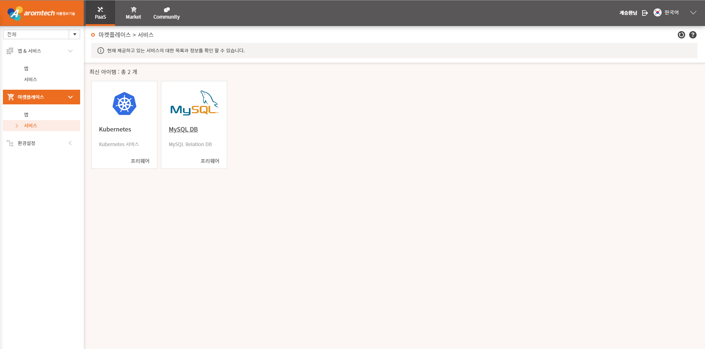

# 1-1. MySQL 서비스 신청하기

MySQL DB를 사용하기 위해 MySQL 서비스를 신청해야 합니다.

서비스를 신청하기 위해서는 기업관리자로부터 개발자 권한을 부여 받아야 합니다.

사용자 포탈에 로그인하고 PaaS &gt; 마켓플레이스 &gt; 서비스 메뉴를 차례대로 선택하면 

다음과 같이 서비스를 선택할 수 있는 페이지가 표시됩니다.

