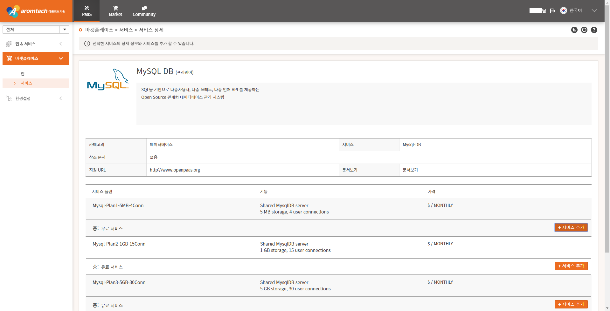
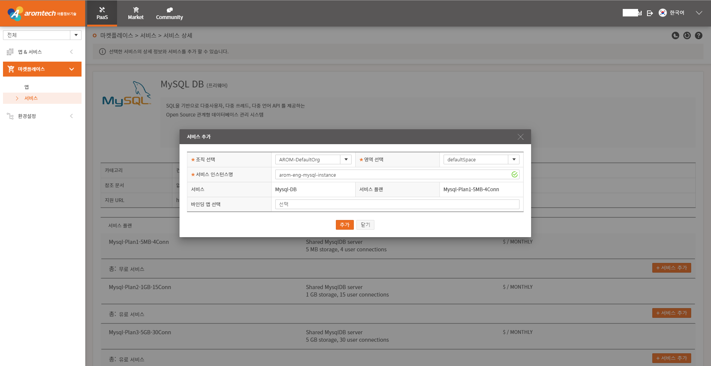
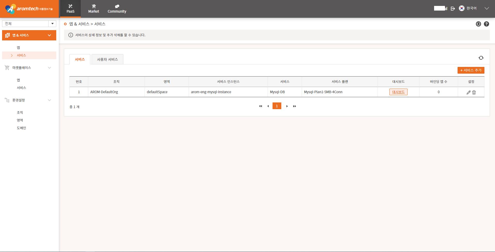

# 1-1. MySQL 서비스 신청하기

MySQL DB를 사용하기 위해 MySQL 서비스를 신청해야 합니다.

서비스를 신청하기 위해서는 기업관리자로부터 개발자 권한을 부여 받아야 합니다.

사용자 포탈에 로그인하고 PaaS &gt; 마켓플레이스 &gt; 서비스 메뉴를 차례대로 선택하면 서비스를 선택할 수 있는 페이지가 표시됩니다.

MySQL DB 링크를 선택하면 MySQL DB 데이터 저장 용량과 동시 사용자 접속 수 플랜 \( plan \)을 선택할 수 있 페이지가 표시됩니다.

원하는 플랜 \( plan \) 영역에 있는 '서비스 추가' 버튼을 선택하면 해당 용량 plan 에 맞게 MySQL 서비스를 신청할 수 있는 팝업 페이지가 표시됩니다.

팝업 페이지에서 '\*' 표시 항목은 필수 입력 항목으로 반드시 입력해야 합니다. 바인딩 앱 선택 항목은 나중에 앱 추가시에 바인딩 가능하므로 입력하지 않아도 됩니다. '추가' 버튼을 선택하면 서비스 추가 완료 페이지가 표시됩니다. 

