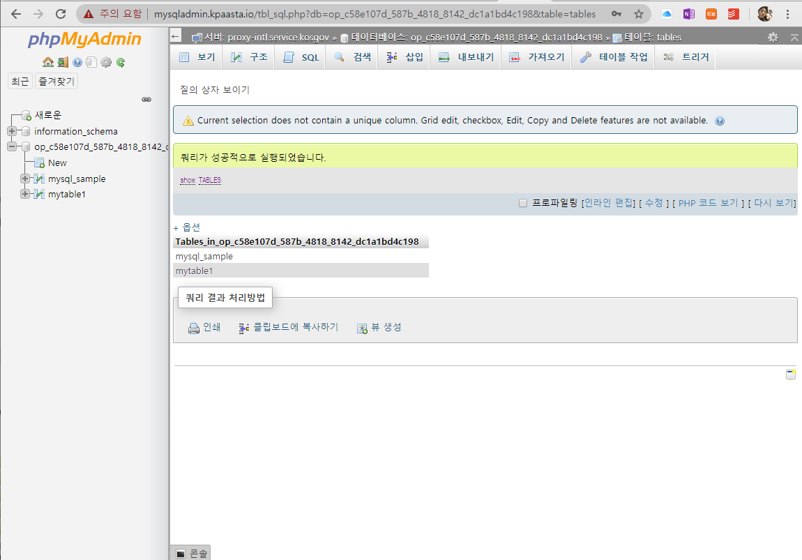
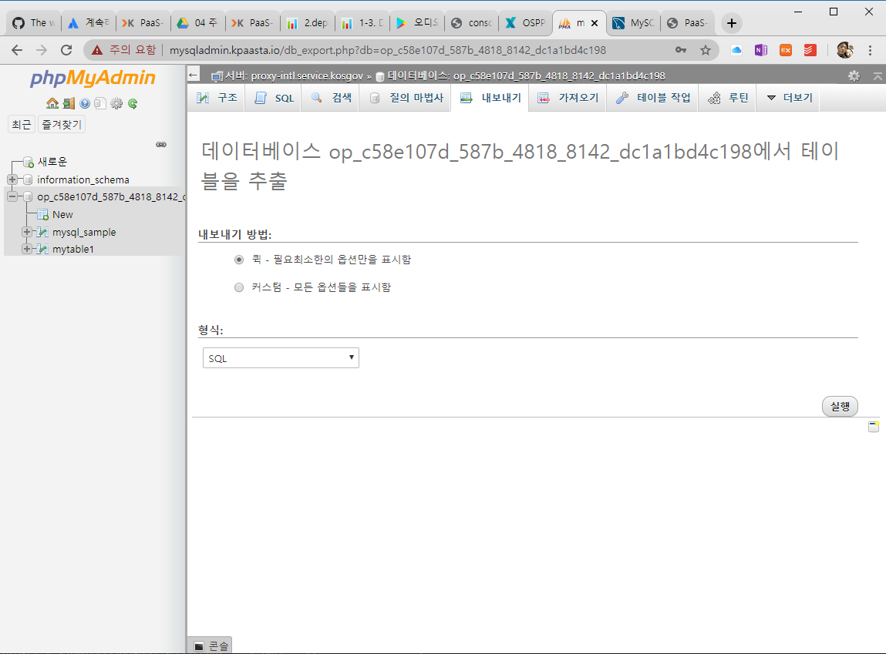
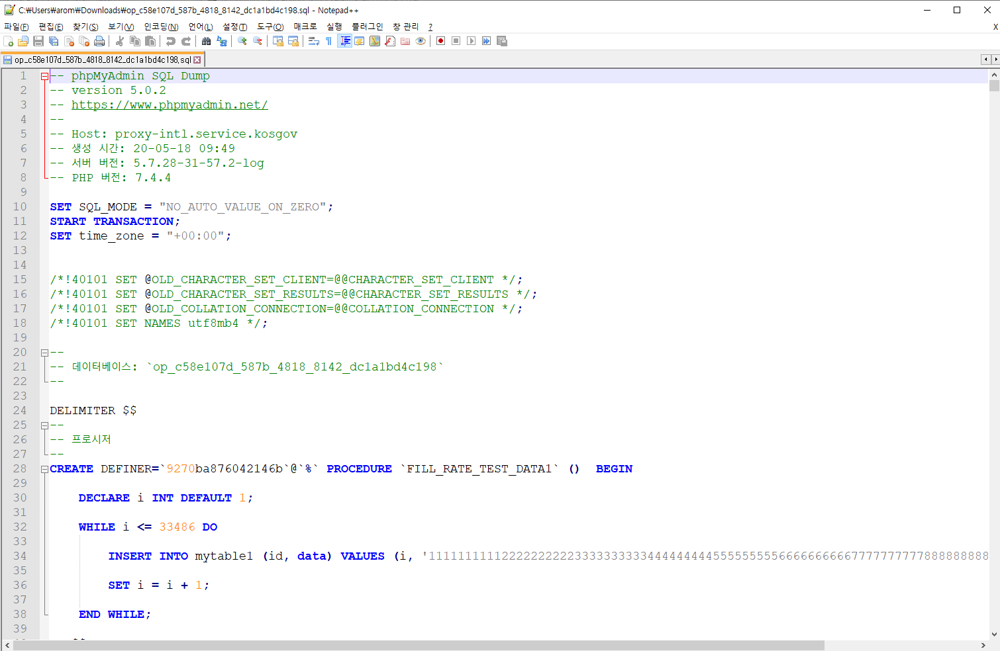

# 1-3. DB 관리

### MySQL DB 접속    

DB Client Tool로 MySQL DB에 접속하기 위해서는 App Bind 를 하여 username, password 접속 정보를 받아야 합니다. [http://mysqladmin.kpaasta.io/](http://mysqladmin.kpaasta.io/) 사이트에서 접속 정보를 이용하여 로그인이 가능합니다.

### MySQL Data Export

mysqladmin.kpaasta.io 사이트에 접속하여 사중인 DB로부터 data를 Export 할 수 있습니다.

우선 아래 화면처럼 쿼리를 이용하여 Database 에 있는 Table List 를 확인합다.

data를 Export 하려는 Database 를 선택하고 내보내기 메뉴를 선택합니다.

데이터 내보내기에서 SQL 형식을 지정하고 실행 버튼을 선택하면 아래처럼 SQL 문으로 구성된 파일이 생성됩니다. 텍스트 보기 프로그램에서 내용을 확인할 수 있습니다.

