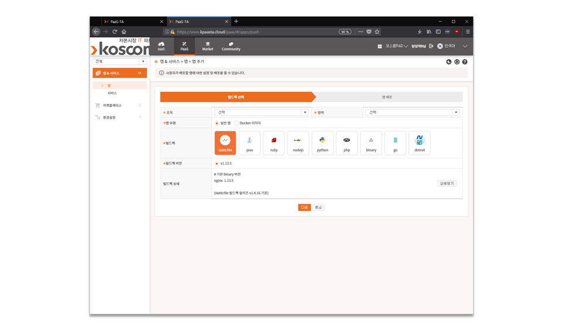

# 4. 이메일 인증을 못했어요

> **안내 :** 메일 인증을 완료한 사용자는 사용할 수 없습니다. 오직 메일 미 인증 사용자만 가능하며, 인증 메일은 발신 기준 10분간 유효합니다. 10분이 지난 인증 메일은 인증이 불가하며, 다시 메일 재 인증 기능을 사용하기시 바랍니다.

메일 인증을 분실하거나, 인증 불가인 경우, 이메일 인증 재발송 기능을 통해 다시 인증 할 수 있습니다. 이는 회원가입을 다시 해야하는 번거로움을 없애고 쉽게 인증 메일을 재 발송 할 수 있습니다.

이메일 인증 재발송에 대해 더 자세히 알아보도록 하겠습니다.

### **로그인 화면 이동**

이메일 인증 재발송을 위해 로그인 화면으로 이동합니다.

로그인 화면 하단에 있는 \[이메일 인증 재발송\] 버튼을 통해 이메일 인증 재발송을 진행합니다.

이메일 인증 재발송이 필요한 계정을 입력 후, 버튼을 클릭하여 이메일 인증 재발송을 완료합니다.

