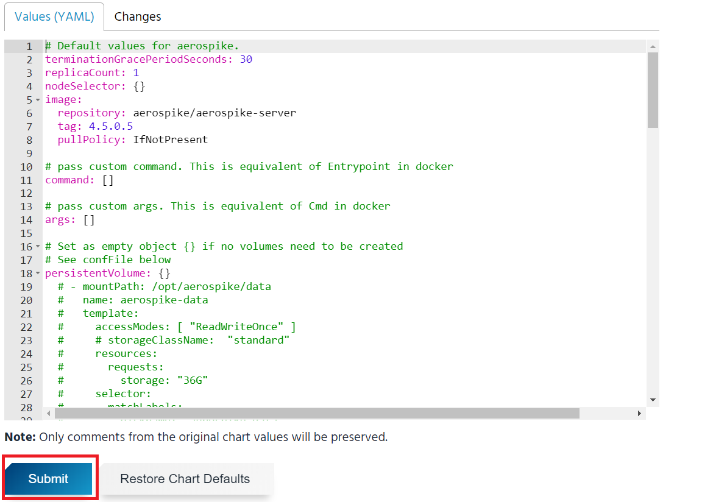

# 4-3. Helm 사용자 가이드

> 안내 : Helm은 kubernetes Package Manager로 클라이언트인 Helm과 cluster 내에 설치되는 tiller 서버로 구성되어 있습니다.

## **1. kubeapps 접속**



##   **2. 사용자 token정보 확인**

## **3. app 배포 테스트-1** 

##    **app 배포 테스트 -2**

##    **app 배포 테스트 -3**

##    **app 배포 테스트 -4**

