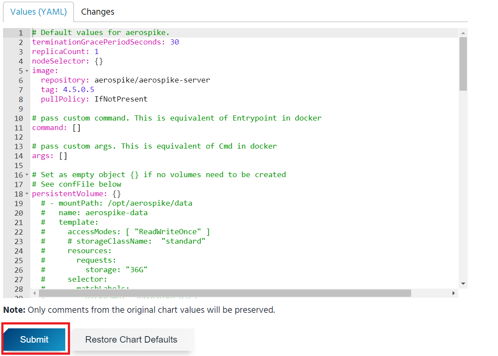

# 4-3. Helm 사용자 가이드

> 안내 : Helm은 kubernetes Package Manager로 클라이언트인 Helm과 cluster 내에 설치되는 tiller 서버로 구성되어 있습니다.


## 1. kubeapps helm배포 가이

##   ****1\) kubeapps 접속




##    ****2\)**사용자 token정보 확인**


##  **3\) app 배포 테스트-1** 


##      **app 배포 테스트 -2**


##      **app 배포 테스트 -3**


##      **app 배포 테스트 -4**



## 2. kubectl helm배포 가이

```text
$ curl -fsSL -o get_helm.sh https://raw.githubusercontent.com/helm/helm/master/scripts/get

$ chmod 700 get_helm.sh

$ ./get_helm.sh (or --version v3.1.2 ) 
Downloading https://get.helm.sh/helm-v2.16.5-linux-amd64.tar.gz
Preparing to install helm and tiller into /usr/local/bin
helm installed into /usr/local/bin/helm
tiller installed into /usr/local/bin/tiller
Run 'helm init' to configure helm.

$ helm init --client-only        # don't upgrade tiller
Creating /home/jmpark93/.helm
Creating /home/jmpark93/.helm/repository
Creating /home/jmpark93/.helm/repository/cache
Creating /home/jmpark93/.helm/repository/local
Creating /home/jmpark93/.helm/plugins
Creating /home/jmpark93/.helm/starters
Creating /home/jmpark93/.helm/cache/archive
Creating /home/jmpark93/.helm/repository/repositories.yaml
Adding stable repo with URL: https://kubernetes-charts.storage.googleapis.com
Adding local repo with URL: http://127.0.0.1:8879/charts
$HELM_HOME has been configured at /home/jmpark93/.helm.
Not installing Tiller due to 'client-only' flag having been set

$ helm repo update                # Make sure we get the latest list of charts

$ helm init --service-account ca35d04e-e605-4022-b4fb-b7d527dd8b7e-kimmart87-admin \
          --tiller-namespace paas-4b5a3805-2ea4-4b41-97af-6b49dcea4120-caas
          
$HELM_HOME has been configured at /root/.helm.

$ helm list --tiller-namespace paas-4b5a3805-2ea4-4b41-97af-6b49dcea4120-caas

NAME            REVISION        UPDATED                         STATUS          CHART           APP VERSION     NAMESPACE
test-mysql      1               Tue Jun 16 13:39:16 2020        DEPLOYED        mysql-1.6.4     5.7.30          paas-4b5a3805-2ea4-4b41-97af-6b49dcea4120-caas


$ helm install -n test-mysql --set persistence.enabled=false stable/mysql \
             --tiller-namespace paas-4b5a3805-2ea4-4b41-97af-6b49dcea4120-caas
             
NAME:   test-mysql
LAST DEPLOYED: Tue Jun 16 13:39:16 2020
NAMESPACE: paas-4b5a3805-2ea4-4b41-97af-6b49dcea4120-caas
STATUS: DEPLOYED

RESOURCES:
==> v1/ConfigMap
NAME             DATA  AGE
test-mysql-test  1     0s
.............................             
```

