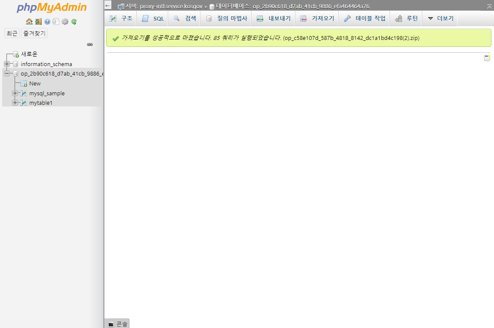

# 1-3. DB 관리

### MySQL DB 접속    

DB Client Tool로 MySQL DB에 접속하기 위해서는 App Bind 를 하여 username, password 접속 정보를 받아야 합니다. [http://mysqladmin.kpaasta.io/](http://mysqladmin.kpaasta.io/) 사이트에서 접속 정보를 이용하여 로그인이 가능합니다.

### MySQL Data Export

MySQL 서비스의 사용 중인 DB로부터 data를 Export 할 수 있습니다. mysqladmin.kpaasta.io 사이트에 로그인합니다.

우선 아래 화면처럼 쿼리를 이용하여 Database 에 있는 Table List 를 확인합다.

data를 Export 하려는 Database 를 선택하고 내보내기 메뉴를 선택합니다.

데이터 내보내기 페이에서 SQL 형식을 지정하고 실행 버튼을 선택하면 아래처럼 SQL 문으로 구성된 파일이 생성됩니다. 텍스트 보기 프로그램에서 내용을 확인할 수 있습니다.

### MySQL Data Import

MySQL 서비스의 사용 중인 DB에 외부에서 가져온  Data를 Import 할 수 있습니다. mysqladmin.kpaasta.io 사이트에 로그인합니다.

우선 Data를 import 할 데이터베이스\(op\_2b...\)를 선택하고 가져오기 메뉴를 선택하면 설정 페이지가 표시됩니다.

Import 설정을 하고 페이지 아래 부분의 '실행' 버튼을 선택하면 Import 가 진행됩니다. 대부분의 설정은 할 필요가 없으며 업로드 파일을 선택하여 다른 Database에서 SQL 형식으로 export 한 Data 저장 파일을 선택합니다. 단, 주의할 사항은 업로드할 파일이 2048KB 이하여야 합니다. 압축한 파일도 가능합니다. Import가 성공하면 아래와 같이 페이지가 표시됩니다.

Import 가 완료된 후에 Data 를 조회하여 데이터가 문제 없는지 확인합니다.

