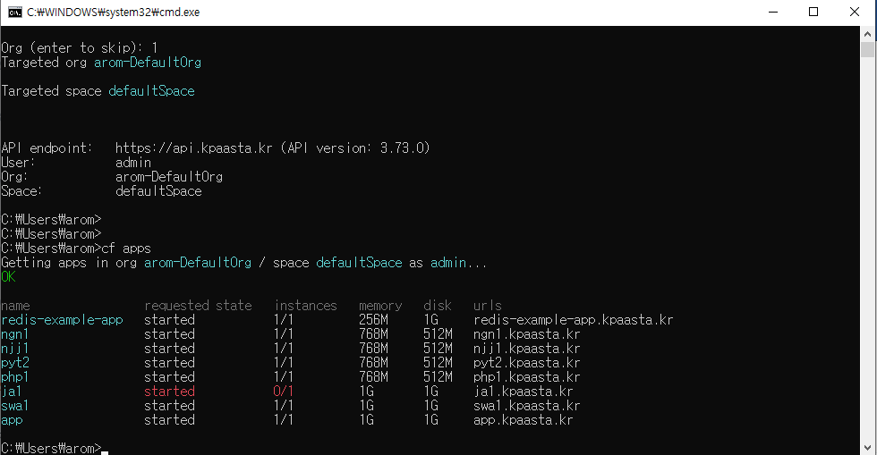

# 5-2. Pipeline 서비스 사용하기

Pipeline 서비스 신청을 완료한 뒤에 관리도구를 통해서 Pipeline 을 생성 할 수 있습니다.

PaaS &gt; 앱 & 서비스 &gt; 서비스 메뉴를 차례대로 선택하면 다음과 같이 Pipeline 관리도구를 선택할 수 있는 페이지가 표시됩니다.

Pipeline 서비스의 관리도구 버튼을 선택하면 다음과 같이 Pipeline  관리도구에 접속할 수 있는 로그인 페이지가 표시됩니다. Pipeline 서비스를 생성할 때 등한 계정 정보를 입력합니다.

유효한 계정 정보를 입력하면 파이프라인 목록 페이지가 표시됩니다. 화면에 3개의 파이프라인이 생성되어 있는 것을 확인할 수 있습니다. 

오른쪽 상단에 있는 신규생성 버튼을 선택하면 신규 생성 페이지가 표시됩니다. 간단한 정보 입력을 통해 신규 파이프라인을 생성할 수 있습니다.

새로 생성된 Pipeline 을 선택하면 파이프라인 상세 화면이 표시됩니다.

빨강색 네모 안을 클릭하여 신규 작업 \(Job\) 을 생성할 수 있습니다. 

먼저 설정을 할 수 있는 페이지가 표시됩니다.

입력 항목에 대해 설명합니다.

내 작업 - 임의의 문자열을 입력합니다.

작업 유형 \(Job\) -  Build / Test / Deploy \(개발/운영 \) 으로 구분하여 선택할 수 있습니다. 

빌더유형 \(type\) - Maven / Gradle 으로 구분하여 선택할 수 있습니.

입력 유형 - 작업으로 관리할 소프트웨어 소스 코드가 어디에 저장되어 있는지를 선택합니다.

                    GitHub / Svn \(Git\) / Svn \(xxx\) 으로 구분하여 선택할 수 있습니다.

                    GitHub 의 경우, GitHub 계정의 id, pw 대신 Token 문자열을 입력해야 합니다.

                    참고 : \( [https://docs.github.com/en/free-pro-team@latest/github/authenticating-to-github/creating-a-personal- access-token](https://docs.github.com/en/free-pro-team@latest/github/authenticating-to-github/creating-a-personal-access-token) \)

                    Svn 의 경우, 해당 svn 계정의 id, pw 를 입력해야 합니다.

                    조회 버튼을 선택하여 해당 소스관리 시스템에 접속가능한지 확인하고 branch 선택합니다.

작업 트리거 - 이 작업을 기동하는 방법을 선택할 수 있습니다. 수동 또는 자동 기동할 수 있습니다.

저장 버튼을 선택하여 설정 내용을 저장합니다.

설정 저장에 문제가 없으면 아래 화면과 같이 신규 Build Job 이 생성됩니다. Build Job 에서는 프로그램 소스 코드를 build 할 수 있습니다. 실행 / 구성 / 로그/히스토리 / 작업정열 기능을 제공합니다.

빌드 job 타이틀 옆의 실행 버튼을 선택하거나 로그/히스토리 버튼을 클릭하여 나타난 로그 페이지에서 실행 버튼을 선택하여 build 작업을 시작할 수 있습니다.

build 가 성공적으로 완료되면 Success 메시지와 함께 화면 왼쪽에 녹색 동그라미 아이콘이 표시됩니다. 

화면 오른쪽에 있는 구성 / 다운로드 / 목록 버튼의 기능은 다음과 같습니다.

구성 - 이전 설정한 설정값을 확인하거나 수정할 수 있습니다.

다운로드 - build 가 성공하면 war / jar 산출물을 로컬 PC로 다운로드 받을 수 있습니다.

목록 - Job 로그 페이지를 벗어나서 파이프라인 상세 페이지로 이동합니다.

파이프라인 상세 페이지에서 테스트 / 배포 작업을 추가할 수 있습니다. 생성된 job 의 추가 버튼을 선택하여 job 을 추가할 수 있습니다. 아래 화면에서 빌드 / 테스트 / 배포 job 이 생성된 내용을 확인할 수 있습니다.

테스트 Job 의 구성 화면은 아래와 같습니다.

테스트 Job 을 수행하여 성공하면 로그/히스토리 페이지에서 품질이슈결과 버튼을 선택하여 테스트 상세 내역을 확인할 수 있습니다.

배포 Job 을 생성하기 전에 Cloud Foundry 정보를 생성하여야 합니다.

파이프라인 관리 &gt; Cloud Foundry 정보 관리 메뉴를 선택합니다.

위 화면에서 Cloud Foundry 계정 등록 버튼을 선택하여 나타난 계정 등록 페이지에서 Cloud Foundry 계정을 등록합니다.

배포 Job 의 구성 화면은 아래와 같습니다. 배포 Job 은 개발과 운영 2가지로 선택하여 생성 가능합니다.

배포 Job 이 실행하여 Success 로 완료되면, 배포된 app 을 실행할 수 있습니다. app 의 이름을 app로 주었다면 'app.kpaasta.kr' URL 로 실행할 수 있습니다.

### CF CLI 를 이용한 App 배포 확

Pipeline 서비스 신청하에서 설명한 PC 용 cf 커맨드 프로그램을 이용하여 pipeline job 에서 생성한 app 의 상태를 확인할 수 있습니다. 

