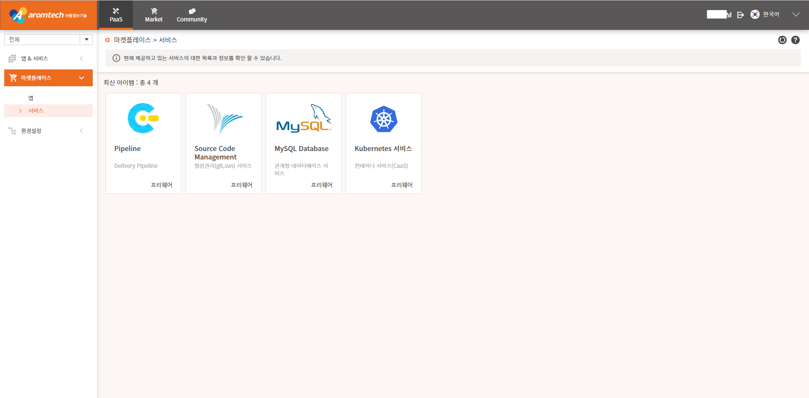
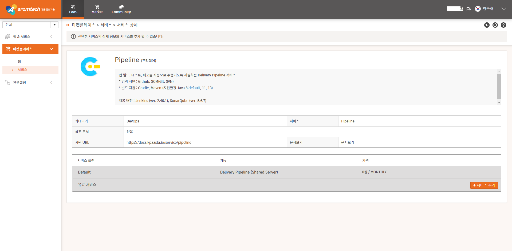
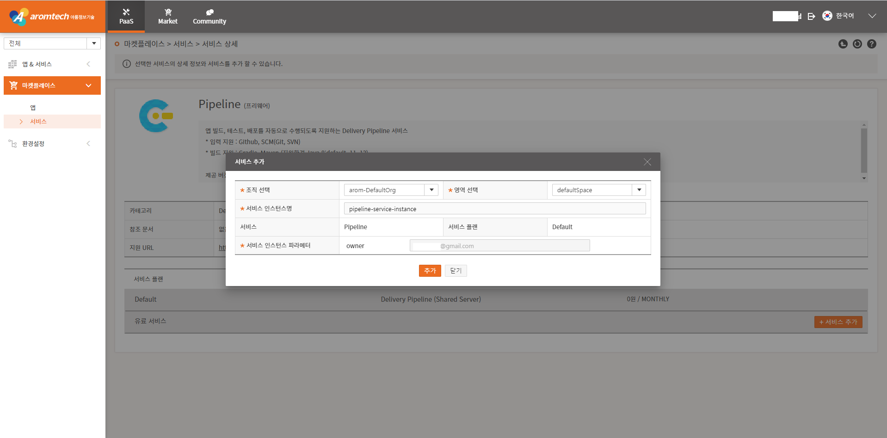
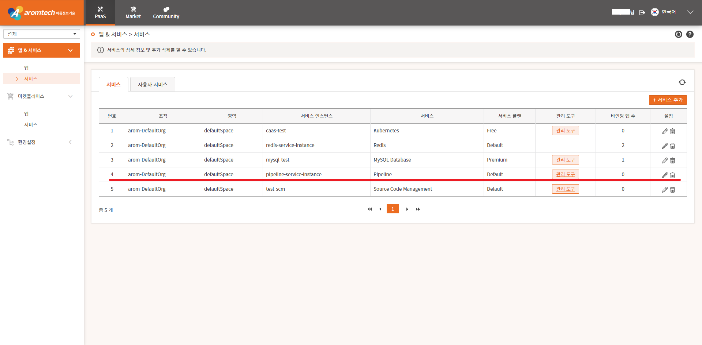
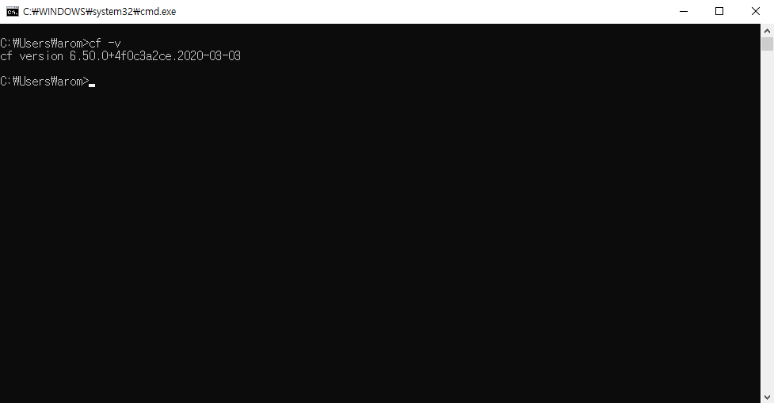
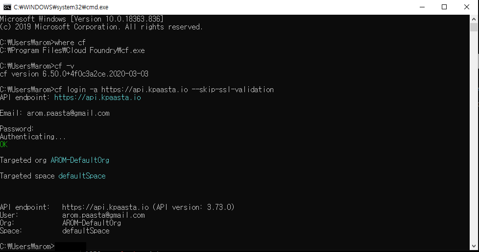
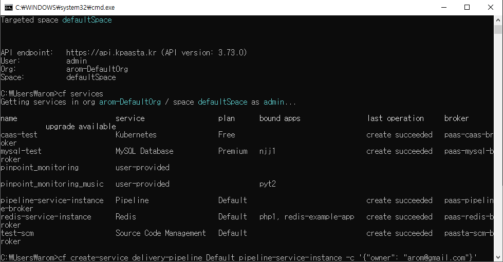

# 2-1. Redis 서비스 신청하기

Redis 서비스를 사용하기 위해 Redis 서비스를 신청해야 합니다.

서비스를 신청하기 위해서는 기업관리자로부터 개발자 권한을 부여 받아야 합니다.

사용자 포탈에 로그인하고 console 로 접속하 PaaS &gt; 마켓플레이스 &gt; 서비스 메뉴를 차례대로 선택하면 서비스를 선택할 수 있는 페이지가 표시됩니다.

Pipeline 링크를 선택하면 사용할 수 있  Default 플랜 \( plan \) 페이지가 표시됩니다.

Default 플랜 \( plan \) 영역에 있는 '서비스 추가' 버튼을 선택하면 서비스 정보를 입력할  수 있는 팝업 페이지가 표시됩니다.

팝업 페이지에서 '\*' 표시 항목은 필수 입력 항목으로 반드시 입력해야 합니다. 서비스 인스턴스 파라메터 정보는 서비스를 사용할 사용자의 계정 정보를 입력합니. '추가' 버튼을 선택하면 서비스 추가 결과 페이지가 표시됩니다. 

### CF CLI 를 이용한 Pipeline 서비스 신청

위에서 설명한 Pipeline 서비스 신청을 명령어로도 처리할 수 있습니다. CF CLI 를 이용합니다.

### CF CLI Windows 버전 설치

[https://cli.run.pivotal.io/stable?release=windows64](https://cli.run.pivotal.io/stable?release=windows64) 페이지에 접속하여 Windows 버전의 CF CLI 프로그을 다운로드 받아 설치합니다. 현재 설치 가능한 버전은 cf-cli-installer\_6.51.0\_winx64.zip 입니다. 설치가 완료되면 설치가 잘되었는지 'cf -v' 를 입력하여 확인합니다.

### 

### CF login 하기

Pipeline 서비스를 신청하기 위해 먼저 CF 에 로그인해야 합니다. 아래와 같이 cf login 명령어를 입력합니다.

### Pipeline 서비스 신청

아래와 같이 cf create-service 명령을 입력하여 Pipeline 서비스를 신청합니다. 여기서는 생성 명령어를 보여주기 위해 서비스 생성 후에 입력했습니다.

cf services 명령어를 입력하여 생성된 서비스를 확인할 수 있습니다.

