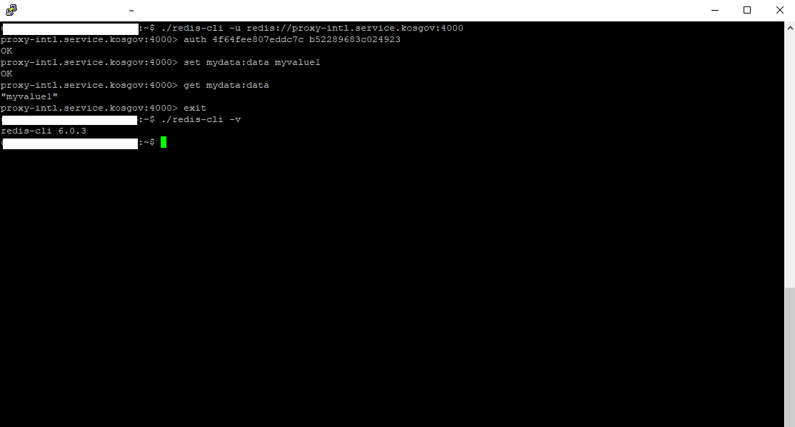

# 2-2. Redis 서비스 사용하기

Redis 서비스 신청을 완료하면 Redis 서비스를 사용할 app에서 서비스 연결 기능을 이용하여 Redis 서비스를 사용할 수 있습니다. Redis 서비스는 관리도구 UI 는 제공하지 않습니다.

PaaS &gt; 앱 & 서비스 &gt; 서비스 메뉴를 차례대로 선택하여 Redis 서비스를 확인해보면 다른 서비스와 달리 관리도구 버튼이 없음을 확인할 수 있습니다.

App에서 Redis 서비스를 사용하기 위해서는 먼저 app을 생성해야 합니다. 설명의 편의를 위해 app 관리 페이지를 통해 sample app을 생성하겠습니다.

PaaS &gt; 앱 & 서비스 &gt;  앱 메뉴를 차례대로 선택하여 앱 관리 페이지를 표시합니다.

앱 추가 버튼을 선택하여 신규 app을 생성할 수 있습니다. 

조직, 영역, 앱 유형, 빌드팩 정보를 입력할 수 있습니다. 여기서는 java 빌드팩을 선택했습니다.

배포 옵션, 앱명 정보를 입력할 수 있습니다. 필요한 정보 입력 후 배포 버튼을 선택합니다.

정상적으로 배포되면 아래와 같이 표시됩니다.

이제 app과 Redis 서비스를 연결\(bind\)할 수 있습니다. 위의 페이지에서 '서비스 연결' 탭의 '서비스 연결 추가' 버튼을 선택합니다.

서비스 인스턴스 항목에 서비스 신청시에 사용하였던 redis-service-instance 문자열을 입력하고 추가 버튼을 선택합니다.

정상적으로 서비스 연결이되면 '접속 정보' 버튼을 선택하여 Redis 서비스에 접속할 수 있는 url, port 정보와 계정 정보를 확인할 수 있습니다. 

이 접속 정보를 사용하여 Redis 서비스를 사용합니다. \( 리눅스에서 접속하여 사용한 예 \)

App을 개발하여 Redis 서비스를 사용하는 경우에는 App Bind 작업을 선행하여야 Redis 서비스를 사용할 수 있는 접속 정보를 얻을 수 있으므로 접속 설정을 외부 파일에서 읽어서 동작하도록 구성하여야 합니다.

### CF CLI 를 이용한 App 배포 확인

Redis 서비스 신청하기에서 설명한 PC 용 cf 커맨드 프로그램을 이용하여 위에서 생성한 redis app 의 상태를 확인할 수 있습니다. 

